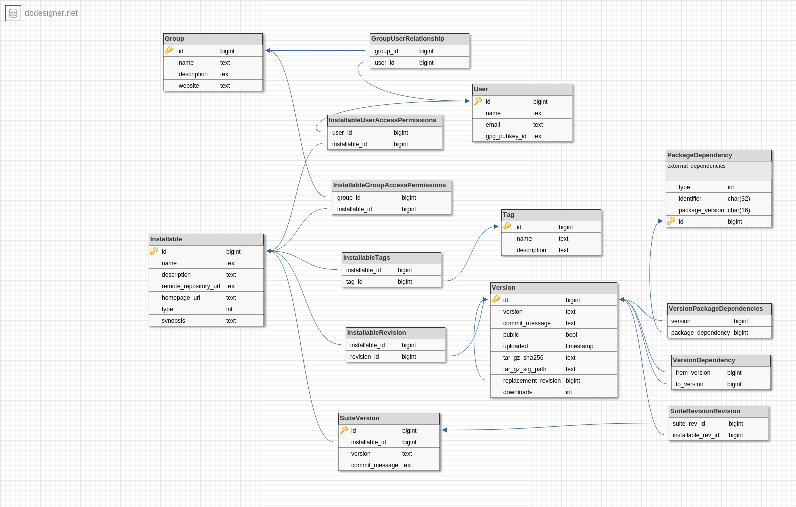

# Galaxy Shed

**NOT A HOSTILE REPLACEMENT**

This is a repository exploring the possibility of a replacement toolshed. This
is a personal time, not-as-a-galaxy-committer project. (I.e. I'm trying *very*
hard not to step on any toes.)

The rationale for this is that the existing toolshed codebase is gigantic, full
of spaghetti, hard to maintain, not under test, etc.

For one reason or another existing options were deemed not appropriate to the
Galaxy use case. PyPi lacks the notion of groups and allows deleting (which
would mean syncing the codebase and maintaining a tree of changes), brew
packages aren't appropriate as an upload store (for those not using git/hg on a
publicly accessible webserver), debian packages aren't meant for storing
html+js viz plugins and are wildly complex for this use case.

I wanted something that anyone could understand in under an hour and begin
working on the codebase. (Less if they know Django)

## Schema

Most of the Group/User relationships should be straightforward. We provide for
user specified GPG key IDs/uploaded public keys to allow end users to verify
packages (assuming they trust the toolshed for fetching public keys.)

### Installables

The `Installable` table is the salient point of this image. It represents the
old concept of a "repository" by the old toolshed. An installable is simply a
metadata holder. The type field will be an enum on [Suite, Tool, DataManager,
Package, Viz, GalaxyInteractiveEnvironments]. More can be added as needed.
Suites are a bit of a special case, however they're still considered
installables like everything else.

By convention:

- packages will only have a single installable (though I'm not sure I agree
  with this completely, so via the UI you'll only be able to install the
  latest, but the API won't make that distinction.)
- Tools will have multiple installable versions as will viz plugins (if they're
  ever "saveable" then they're essentially non-rerunable tools.)
- Suites are more like packages in taht they only have one installable revision

### Revisions

Installables have multiple revisions, which represents a single, real,
installable thing. These are stored in the `Revision` table. They have a path
to an on-disk .tar.gz file containing everything needed for that package
(including the `.shed.yml` file or equivalent.) A revision has a version number
and a preferrably git-style commit message saying what has been changed. There
is a public boolean enabling the user to upload private versions of packages
for testing (thereby deprecating the TTS). We will generate a sha256sum on the
server side for uploaded packages (and maybe require on uploader side for
verification?), and allow for user submission of a GPG key signature for a
revision release.

The `replacement_revision` field is of note, this will provide an upgrade path
for deprecated installables. There are a couple ways to handle this and I
haven't settled on one yet. Either we ignore it EXCEPT in the case of
changed-parent-installable "replacements", or we set it on every upload EXCEPT
the latest version of each Revision. TODO.

### Suites

Suites are metapackages holding numerous individual Revisions. They were
designed this way intentionally: Alice installing a given version of a suite
should give her precisely identical versions of packages as Bob.

Suites use a linker table called `SuiteRevision` instead of
`InstallableRevision`, as the `SuiteReivision` table is halfway in between the
`InstallableRevision` and `Revision` tables in functionality. A `SuiteRevision`
is like a `Revision` in that it has a version number and commit message,
however it is unlike a `Revision` in that it isn't the end of the line, it
instead consists of multiple `Revision` objects with their own versions and
commit messages.

### Tags

Tags are presented in alternative to "categories" in the old toolshed.
Categories are hardcoded things which must be configured by an administrator
(or in the case of the MTS configured by requesting it on the -dev mailinglist
and garnering support for your category.) Tags are user-specified and
democratic. We allow anyone to submit new tags. We're taking it on faith
that users will be generally sensible and tag their software well.

This also sidesteps some issues in the current TS where packages are invisible
if they aren't in one predefined category.

## Other Design Considerations

- `server` component is JUST a RESTful API
- Allow for google/github logins
- Test, Test, Test.
- pip installable

# Feedback

Questions? Comments? Concerns? Submit an issue! This repository will hold
design documentation as well as all deliverables. Please, please talk about
these things `:)`

# License

This software is licensed under the AGPLv3.
